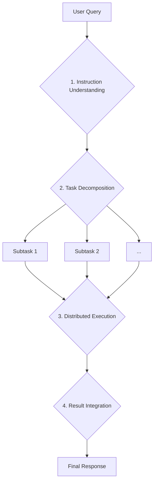
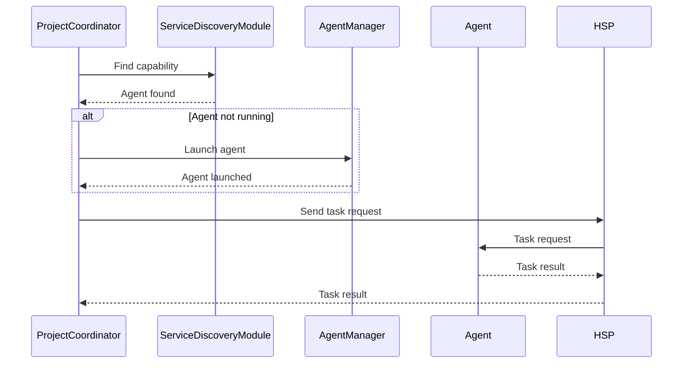

# Unified AI Project Charter

This document serves as the single source of truth for the Unified AI Project, providing a comprehensive overview of its architecture, components, workflows, status, and future plans.

---

## 1. Project Overview

The Unified AI Project is a sophisticated, multi-agent system designed for complex task execution. It features a modular and scalable architecture that allows for dynamic collaboration between a central coordinator and specialized agents.

### 1.1. High-Level Architecture

The project follows a distributed, service-oriented architecture where a central "meta-agent" named Angela orchestrates the execution of complex tasks by delegating them to a network of specialized sub-agents. The key architectural principles are:

- **Modularity**: The system is composed of independent components with well-defined responsibilities, such as dialogue management, project coordination, agent management, and communication.
- **Scalability**: New capabilities can be added by creating new agents and tools without modifying the core system. The use of a message broker (MQTT) for communication allows the system to scale to a large number of agents.
- **Dynamic Collaboration**: The system can dynamically launch and shut down agents based on the requirements of the task at hand. This allows for efficient use of resources.
- **Service-Oriented**: Agents expose their functionalities as services on a network, which can be discovered and consumed by other components.

The following diagram illustrates the high-level architecture of the project:

```mermaid
graph TD
    subgraph User Interfaces
        A[FastAPI Web Server]
        B[Command-Line Interface]
    end

    subgraph Core System
        C[Dialogue Manager]
        D[Project Coordinator]
        E[Agent Manager]
        F[Service Discovery]
        G[HAM Memory]
        H[Learning Manager]
    end

    subgraph Communication
        I[HSP Connector (MQTT)]
    end

    subgraph Agents
        J[Data Analysis Agent]
        K[Creative Writing Agent]
        L[...]
    end

    A --> C
    B --> C
    C --> D
    D -- Manages --> E
    D -- Uses --> F
    D -- Communicates via --> I
    I -- Communicates with --> J
    I -- Communicates with --> K
    I -- Communicates with --> L
    E -- Launches/Terminates --> J
    E -- Launches/Terminates --> K
    E -- Launches/Terminates --> L
    F -- Discovers --> J
    F -- Discovers --> K
    F -- Discovers --> L
    D -- Uses --> G
    D -- Uses --> H
```

### 1.2. Core Components

This section provides a detailed description of each major component of the Unified AI Project.

#### Entry Points

The system provides two primary entry points for user interaction:

-   **`src/services/main_api_server.py`**: A FastAPI application that exposes a RESTful API for interacting with the AI. It handles chat, session management, and HSP-related requests. It uses a `lifespan` event handler to initialize and shut down the core services.
-   **`src/interfaces/cli/main.py`**: A command-line interface that allows users to interact with the AI from the terminal. It supports sending queries and publishing facts to the HSP network.

#### Core Services (`src/core_services.py`)

This module is the heart of the application's backend. It uses a singleton pattern to initialize and provide access to all major components. The `initialize_services` function is called by the entry points to set up the application's environment.

#### Dialogue and Project Management

-   **`src/core_ai/dialogue/dialogue_manager.py`**: The `DialogueManager` is the first point of contact for user queries. It identifies complex project requests and delegates them to the `ProjectCoordinator`. For simpler queries, it can provide a direct response.
-   **`src/core_ai/dialogue/project_coordinator.py`**: The `ProjectCoordinator` implements the "four-draw" model for complex task execution. It decomposes a project query into a dependency graph of subtasks, orchestrates the execution of these tasks by delegating them to the appropriate agents, and integrates the results into a final response.

#### Agent Collaboration Framework

-   **`src/core_ai/agent_manager.py`**: The `AgentManager` is responsible for managing the lifecycle of the sub-agents. It can discover available agent scripts, launch them in separate processes when needed, and terminate them when they are no longer required.
-   **`src/core_ai/service_discovery/service_discovery_module.py`**: This module keeps track of the capabilities advertised by all agents on the HSP network. The `ProjectCoordinator` uses it to find the right agent for a given task. It also handles stale capabilities and filters them based on trust scores.
-   **`src/agents/`**: This directory contains the implementations of the specialized sub-agents. Each agent inherits from `BaseAgent`, defines its capabilities, and implements a `handle_task_request` method to process tasks.

#### Communication

-   **`src/hsp/connector.py`**: The `HSPConnector` is a gmqtt-based client that handles all communication over the Heterogeneous Service Protocol (HSP) network. It provides methods for publishing facts, sending task requests, and receiving results.
-   **HSP (Heterogeneous Service Protocol)**: A custom protocol built on top of MQTT that defines the message formats and communication patterns for interaction between the coordinator and the agents.

#### Learning and Memory

-   **`src/core_ai/memory/ham_memory_manager.py`**: The `HAMMemoryManager` provides a Hierarchical Abstractive Memory for storing and retrieving experiences, facts, and dialogue context.
-   **`src/core_ai/learning/learning_manager.py`**: The `LearningManager` is responsible for learning from completed projects to improve future performance. It can analyze successful and failed project executions to refine its strategies.

#### Backup and Recovery: The "Trinity" Model

The project includes a "Trinity" model for backup and recovery, ensuring the resilience and persistence of the AI's "digital life". This model is based on a (2, 3) Shamir's Secret Sharing scheme, which allows for the complete reconstruction of the AI's identity and memory from any two of three "Shards". The three core components are:

-   **UID (Unique Identifier)**: The AI's permanent, public identifier.
-   **HAM Key**: The encryption key for the HAM memory.
-   **Data Core Seed**: A random value to initialize the memory state.

This system provides a high level of security and redundancy, protecting against data loss.

### 1.3. Key Workflows

This section illustrates the key workflows of the Unified AI Project.

#### The "Four-Draw" Model for Complex Project Execution

The "four-draw" model is the core workflow for handling complex user requests. It consists of four main phases:

1.  **Instruction Understanding and Expansion**: The `ProjectCoordinator` receives a user query and uses an LLM to expand it into a detailed project plan.
2.  **Task Decomposition and Publishing**: The `ProjectCoordinator` decomposes the project plan into a DAG of subtasks and publishes them to the HSP network.
3.  **Distributed Execution and Result Return**: Specialized agents on the network execute the subtasks and return the results.
4.  **Result Integration and Feedback**: The `ProjectCoordinator` integrates the results from the agents into a final response and presents it to the user.

The following diagram illustrates this workflow:



#### Agent Discovery and Task Dispatching

When the `ProjectCoordinator` needs to execute a subtask, it follows this workflow to find and dispatch it to an agent:

1.  **Find Capability**: The `ProjectCoordinator` queries the `ServiceDiscoveryModule` to find an agent with the required capability.
2.  **Launch Agent (if necessary)**: If no running agent has the required capability, the `ProjectCoordinator` asks the `AgentManager` to launch a suitable agent.
3.  **Send Task Request**: The `ProjectCoordinator` sends a task request to the agent via the `HSPConnector`.
4.  **Wait for Result**: The `ProjectCoordinator` waits for the agent to complete the task and return the result.

The following diagram illustrates this workflow:



#### HSP Communication Flow

All communication between the `ProjectCoordinator` and the agents is done via the HSP protocol over MQTT. Here's a typical communication flow:

1.  **Agent Advertisement**: When an agent starts, it advertises its capabilities by publishing an `HSPCapabilityAdvertisementPayload` message to the HSP network.
2.  **Task Request**: The `ProjectCoordinator` sends a task to an agent by publishing an `HSPTaskRequestPayload` message.
3.  **Task Result**: The agent completes the task and returns the result by publishing an `HSPTaskResultPayload` message.

This asynchronous, message-based communication allows for a flexible and scalable system.

### 1.4. Configuration and Setup

This section explains how to set up and configure the Unified AI Project.

#### Dependencies and Installation

The project's dependencies are defined in `pyproject.toml` and are categorized into `core`, `ai`, `web`, `testing`, etc. This allows for flexible installation based on the desired features.

The recommended way to install the project is to use the command-line installer:

```bash
python installer_cli.py
```

This script guides the user through the installation process, including selecting an installation type (e.g., `minimal`, `standard`, `full`) and generating the `.env` file.

#### Environment Variables

The project uses a `.env` file for configuration. A template for this file is provided in `.env.example`. The key environment variables are:

-   `MIKO_HAM_KEY`: The encryption key for the HAM memory manager.
-   `GEMINI_API_KEY`: The API key for Google Gemini.
-   `OPENAI_API_KEY`: The API key for OpenAI.
-   `PYTHON_EXECUTABLE`: The path to the Python executable.

#### Running the Application

The application can be run in several ways:

-   **API Server**: `uvicorn src.services.main_api_server:app --reload --host 0.0.0.0 --port 8000`
-   **CLI**: `python src/interfaces/cli/main.py query "Your query"`
-   **Agents**: `python src/agents/data_analysis_agent.py`

---

## 2. Refactoring and Cleanup Plan

**Current Status: Completed**

This section outlines a plan for refactoring and cleaning up the Unified AI Project codebase. The proposed changes are based on a review of the source code, tests, documentation, and configuration files.

### 2.1. Source Code (`/src`)

#### `ProjectCoordinator` (`src/core_ai/dialogue/project_coordinator.py`)

-   **Issue**: Hardcoded prompts for task decomposition and result integration.
-   **Status**: **Completed**
-   **Proposed Change**: Move the prompts to a configuration file (e.g., `configs/prompts.yaml`) to make them more maintainable and customizable.

-   **Issue**: Lack of robust error handling in `_substitute_dependencies`.
-   **Status**: **Completed**
-   **Proposed Change**: Add a `try...except` block to handle potential `TypeError` exceptions when calling `json.dumps` on non-serializable objects.

-   **Issue**: Fragile `asyncio.sleep(5)` after launching an agent.
-   **Status**: **Completed**
-   **Proposed Change**: Implement a more robust handshake mechanism. The `AgentManager` could return a future that is completed when the agent has successfully advertised its capabilities. The `ProjectCoordinator` would then `await` this future before sending a task request.

#### `HSPConnector` (`src/hsp/connector.py`)

-   **Issue**: Duplicate docstrings in the `HSPConnector` class.
-   **Status**: **Completed**
-   **Proposed Change**: Remove the redundant single-line docstring.

-   **Issue**: The `on_message` method is too long and complex.
-   **Status**: **Completed**
-   **Proposed Change**: Refactor the `on_message` method into smaller, more focused methods (e.g., `_decode_message`, `_handle_ack`, `_dispatch_payload`).

#### `ServiceDiscoveryModule` (`src/core_ai/service_discovery/service_discovery_module.py`)

-   **Issue**: Stale capabilities are not removed from the `known_capabilities` dictionary.
-   **Status**: **Completed**
-   **Proposed Change**: Implement a periodic cleanup task that removes stale capabilities. This could be a background task that runs every few minutes.

#### `AgentManager` (`src/core_ai/agent_manager.py`)

-   **Issue**: No way to pass arguments to agent scripts.
-   **Status**: **Completed**
-   **Proposed Change**: Modify the `launch_agent` method to accept a list of arguments that can be passed to the agent script.

-   **Issue**: No health check mechanism for agents.
-   **Status**: **Completed**
-   **Proposed Change**: Implement a simple health check mechanism. The `BaseAgent` could expose an `is_healthy` method that can be called by the `AgentManager`.

### 2.2. Tests (`/tests`)

-   **Issue**: No dedicated unit tests for `ProjectCoordinator`.
-   **Status**: **Completed**
-   **Proposed Change**: Create a new test file `tests/core_ai/dialogue/test_project_coordinator.py` with comprehensive unit tests for the `ProjectCoordinator`'s logic.

-   **Issue**: Limited integration test scenarios.
-   **Status**: **Completed**
-   **Proposed Change**: Add more integration tests to `tests/integration/test_agent_collaboration.py` to cover edge cases and failure modes, such as failing subtasks and agent launch failures.

-   **Issue**: Lack of "real" integration tests.
-   **Status**: **Not Completed**
-   **Proposed Change**: Create a new integration test file that uses a live (or mock) MQTT broker and actual agent processes to test the full end-to-end workflow. This would provide a higher level of confidence in the system's correctness.

### 2.3. Documentation (`/docs`)

-   **Issue**: The `PROJECT_OVERVIEW.md` file does not mention the "Trinity" model for backup and recovery.
-   **Status**: **Completed**
-   **Proposed Change**: Add a section to `PROJECT_OVERVIEW.md` that explains the "Trinity" model, based on the information in `docs/technical_design/architecture/HAM_design_spec.md`.

-   **Issue**: "Conceptual" features are scattered across different documents.
-   **Status**: **Completed**
-   **Proposed Change**: Create a new `ROADMAP.md` file in the `docs` directory to collect all the "conceptual" and "future" features into a single, consolidated view of the project's future direction.

-   **Issue**: Markdown files with parsing errors.
-   **Status**: **Completed**
-   **Proposed Change**: Scan and fix all Markdown files with parsing errors.

### 2.4. Configuration

-   **Issue**: Redundancy in dependency management between `pyproject.toml` and `dependency_config.yaml`.
-   **Status**: **Completed**
-   **Proposed Change**: Consolidate the dependency groups into `dependency_config.yaml` and either remove the `[project.optional-dependencies]` from `pyproject.toml` or generate it from `dependency_config.yaml`. The latter would be the preferred approach to maintain compatibility with standard Python tooling.

---

## 3. Dependency Cleanup Plan

**Current Status: Completed**

This section outlines a plan for cleaning up and organizing the dependencies of the Unified AI Project.

### 3.1. Missing Dependencies

-   **Status**: **Completed**
-   **`aiounittest`**: Add to the `testing` group in `dependency_config.yaml`.
-   **`amqtt`**: Add as a fallback for `paho-mqtt` in `dependency_config.yaml`.
-   **`beautifulsoup4`**: The `bs4` import comes from the `beautifulsoup4` package. Add this to the `optional` dependencies in `dependency_config.yaml` under a new `web_scraping` feature.
-   **`github3.py`**: The `github` import likely comes from the `github3.py` package. Add this to the `optional` dependencies in `dependency_config.yaml` under a new `integrations` feature.
-   **`gmqtt`**: Add as a fallback for `paho-mqtt` in `dependency_config.yaml`.
-   **`huggingface-hub`**: This is a dependency of `sentence-transformers`. It should be added to the `ai_focused` installation group in `dependency_config.yaml`.
-   **`pandas`**: Move from an optional to a core dependency in `dependency_config.yaml`.
-   **`pytest`**: Add to the `testing` group in `dependency_config.yaml`.
-   **`scikit-image`**: The `skimage` import comes from the `scikit-image` package. Add this to the `optional` dependencies in `dependency_config.yaml` under a new `image_processing` feature.
-   **`scikit-learn`**: The `sklearn` import comes from the `scikit-learn` package. Move from an optional to a core dependency in `dependency_config.yaml`.
-   **`SpeechRecognition`**: Add to the `optional` dependencies in `dependency_config.yaml` under a new `audio` feature.
-   **`transformers`**: This is a dependency of `sentence-transformers`. It should be added to the `ai_focused` installation group in `dependency_config.yaml`.

### 3.2. Unused Dependencies

-   **Status**: **Completed**
-   **`langchain`**: Remove from `dependency_config.yaml`.

### 3.3. Dependency Name Normalization

-   **Status**: **Completed**
-   The following dependencies have a mismatch between their package name and their import name. I will update `dependency_config.yaml` and `scripts/compare_imports.py` to use the correct names.
    -   `faiss-cpu` -> `faiss`
    -   `paho-mqtt` -> `paho`
    -   `pytest-asyncio` -> `pytest_asyncio`
    -   `python-dotenv` -> `dotenv`
    -   `PyYAML` -> `yaml`
    -   `secret-sharing` -> `secretsharing`

### 3.4. Recategorization of Dependencies

-   **Status**: **Completed**
-   Move `pandas` and `scikit-learn` to the `core` dependencies in `dependency_config.yaml` as they seem to be used in core functionalities.
-   Create new feature groups in `dependency_config.yaml` for `web_scraping`, `integrations`, `image_processing`, and `audio` to better organize the optional dependencies.

By implementing these changes, we can ensure that the project's dependencies are well-organized, consistent, and accurately reflect the project's needs.
