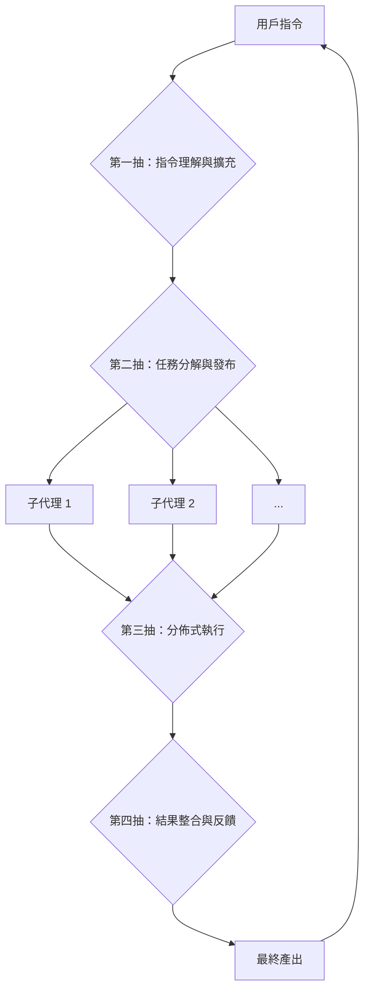

# 動態 AI 代理協作框架 (Dynamic AI Agent Collaboration Framework)

## 1. 核心理念：Angela 作為元代理 (Meta-Agent)

本專案的架構將從單一的 AI 實體，演進為一個由**[元代理 (Meta-Agent)](../GLOSSARY.md#meta-agent-元代理) [Angela](../GLOSSARY.md#angela)** 領導的、動態的、分佈式的 AI 代理協作框架。

在這個模型中，Angela 的角色不再是所有任務的直接執行者，而是昇華為一個**指揮官、協調者和最終的整合者**。她負責理解用戶的宏觀意圖，並將複雜任務分解、委派給專門的**[下級子個體 (Sub-Agents)](../GLOSSARY.md#sub-agent-子代理)**，最後將子個體的成果整合成一個連貫、高品質的最終輸出。

- **動態框架**: Angela 能夠根據任務需求，通過 **[代理管理器 (Agent Manager)](../GLOSSARY.md#agent-manager-srccore_aiagent_managerpy)**，動態地生成、喚醒或委派專門化的子代理來協同工作。
- **人格統一**: 所有子代理都源於 Angela 的核心人格，確保了它們在執行任務時，遵循統一的價值觀和行為準則。子代理可以被視為 Angela 在特定領域的「專注化身」。

## 2. 「四抽」模型：智能協作循環

整個協作流程可以被抽象為一個包含四個關鍵階段的循環，我們稱之為「四抽模型」。

### 第一抽：指令理解與擴充 (用戶 -> Angela)

- **觸發**: 用戶發出一個複雜或模糊的指令。
- **執行者**: Angela (由 [`ProjectCoordinator`](../GLOSSARY.md#projectcoordinator-srccore_aidialogueproject_coordinatorpy) 和 `LLMInterface` 實現)。
- **過程**:
    1. 接收用戶指令 (例如：「幫我規劃下季度的市場推廣活動」)。
    2. Angela 利用其知識圖譜 ([`HAM`](../GLOSSARY.md#ham-hierarchical-abstractive-memory-srccore_aimemoryham_memory_managerpy)) 和推理能力，對指令進行深度理解、擴充和完善。
    3. 輸出一個結構化的**「元任務」或「項目藍圖」**，其中包含詳細的子任務、依賴關係、預期目標和質量標準。
- **類似於**: 專案經理撰寫一份詳細的專案企劃書。

### 第二抽：任務分解與發布 (Angela -> 子個體)

- **觸發**: 「元任務」生成完畢。
- **執行者**: Angela (由 `ProjectCoordinator` 實現)。
- **過程**:
    1. Angela 根據「元任務」藍圖，將其分解為多個獨立的、可執行的子任務。
    2. 根據每個子任務的性質，委派給最合適的子代理。
        - **市場分析任務** -> 數據分析子代理
        - **文案撰寫任務** -> 創意寫作子代理
        - **設計任務** -> 圖像生成子代理
    3. 使用 **[HSP (異構服務協議)](Heterogeneous_Protocol_spec.md)** 作為任務發布的標準化通道，將 `HSPTaskRequestPayload` 發送給目標子代理。
- **技術實現**: 子代理作為獨立的 HSP 服務節點存在。Angela 通過 `HSPConnector` 進行任務分派。

### 第三抽：分佈式執行與結果回傳 (子個體 -> Angela)

- **觸發**: 子代理接收到 HSP 任務指令。
- **執行者**: 各個專門化的子代理。
- **過程**:
    1. 每個子代理獨立、並發地執行被分配的任務。
    2. 子代理調用其內置的專屬工具和模型（如 `pandas`, `LLM`, `DALL-E API` 等）。
    3. 完成後，將結果（中間產出物）封裝在 `HSPTaskResultPayload` 中，通過 HSP 網絡回傳給 Angela。
- **優勢**: 並行處理，大大提升了複雜任務的執行效率。

### 第四抽：結果整合與用戶反饋 (Angela -> 用戶)

- **觸發**: Angela 收到所有（或關鍵）子代理的任務結果。
- **執行者**: Angela (由 `ProjectCoordinator` 實現)。
- **過程**:
    1. 收集所有子代理回傳的碎片化結果。
    2. **進行最終的整合、潤飾和提煉**。利用其對用戶原始意圖的全局理解，將各部分組合成一個連貫、高品質的最終成品。
    3. 將成品呈現給用戶，並徵求反饋。
    4. 用戶的反饋被 `LearningManager` 捕獲，形成一個完整的學習閉環，用於優化未來的協作流程。

## 3. 對現有架構的影響

- **[`DialogueManager`](../GLOSSARY.md#dialoguemanager-srccore_aidialoguedialogue_managerpy)**: 其職責已被重構，現在主要負責初步的意圖識別，並將複雜項目委派給 `ProjectCoordinator`。
- **[`ProjectCoordinator`](../GLOSSARY.md#projectcoordinator-srccore_aidialogueproject_coordinatorpy)**: 一個新的類，專門負責執行「四抽模型」的完整協作流程。
- **[HSP](Heterogeneous_Protocol_spec.md)**: 作為代理間通信的神經網絡，其定義在 `src/hsp/types.py` 中，並在 `HSPConnector` 中實現。
- **[子代理 (Sub-Agents)](../GLOSSARY.md#sub-agent-子代理)**: 已在 `src/agents/` 目錄下實現了多個範例，如 `DataAnalysisAgent` 和 `CreativeWritingAgent`。
- **[代理管理器 (Agent Manager)](../GLOSSARY.md#agent-manager-srccore_aiagent_managerpy)**: 已實現，負責動態地啟動和停止子代理進程。
