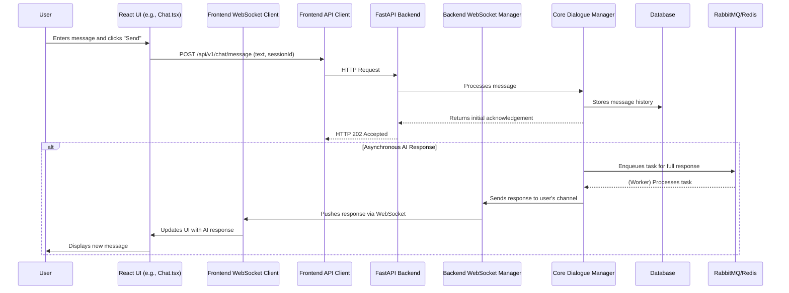

# Frontend-Backend Connection Flow

This document illustrates the data flow from a user interaction in the Electron/React frontend to the FastAPI backend and back.

```mermaid
sequenceDiagram
    participant User
    participant ReactUI as React UI (e.g., Chat.tsx)
    participant WebSocketClient as Frontend WebSocket Client
    participant APIClient as Frontend API Client
    participant FastAPIBackend as FastAPI Backend
    participant WebSocketManager as Backend WebSocket Manager
    participant DialogueManager as Core Dialogue Manager
    participant Database
    participant MessageQueue as RabbitMQ/Redis

    User->>ReactUI: Enters message and clicks "Send"
    ReactUI->>APIClient: POST /api/v1/chat/message (text, sessionId)
    APIClient->>FastAPIBackend: HTTP Request
    FastAPIBackend->>DialogueManager: Processes message
    DialogueManager->>Database: Stores message history
    DialogueManager-->>FastAPIBackend: Returns initial acknowledgement
    FastAPIBackend-->>APIClient: HTTP 202 Accepted

    alt Asynchronous AI Response
        DialogueManager->>MessageQueue: Enqueues task for full response
        MessageQueue-->>DialogueManager: (Worker) Processes task
        DialogueManager->>WebSocketManager: Sends response to user's channel
        WebSocketManager->>WebSocketClient: Pushes response via WebSocket
        WebSocketClient->>ReactUI: Updates UI with AI response
        ReactUI->>User: Displays new message
    end
```
