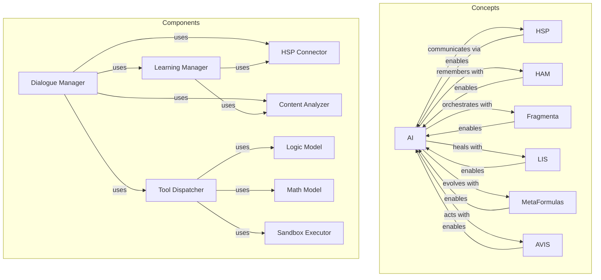

```mermaid
graph TD
    subgraph Concepts
        A[AI]
        B[HSP]
        C[HAM]
        D[Fragmenta]
        E[LIS]
        F[MetaFormulas]
        G[AVIS]
    end

    subgraph Components
        H[Dialogue Manager]
        I[Learning Manager]
        J[HSP Connector]
        K[Content Analyzer]
        L[Tool Dispatcher]
        M[Sandbox Executor]
        LM[Logic Model]
        MM[Math Model]
    end

    A -- "communicates via" --> B
    A -- "remembers with" --> C
    A -- "orchestrates with" --> D
    A -- "heals with" --> E
    A -- "evolves with" --> F
    A -- "acts with" --> G

    H -- "uses" --> I
    H -- "uses" --> J
    H -- "uses" --> K
    H -- "uses" --> L

    L -- "uses" --> LM
    L -- "uses" --> MM

    I -- "uses" --> J
    I -- "uses" --> K

    L -- "uses" --> M

    B -- "enables" --> A
    C -- "enables" --> A
    D -- "enables" --> A
    E -- "enables" --> A
    F -- "enables" --> A
    G -- "enables" --> A
```
