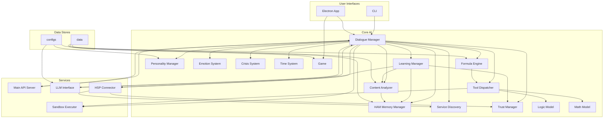

```mermaid
graph TD
    subgraph User Interfaces
        A[CLI]
        B[Electron App]
    end

    subgraph Core AI
        C[Dialogue Manager]
        D[Learning Manager]
        E[HAM Memory Manager]
        F[Formula Engine]
        G[Tool Dispatcher]
        H[Personality Manager]
        I[Emotion System]
        J[Crisis System]
        K[Time System]
        L[Content Analyzer]
        M[Service Discovery]
        N[Trust Manager]
        LM[Logic Model]
        MM[Math Model]
        GAME[Game]
    end

    subgraph Services
        O[Main API Server]
        P[LLM Interface]
        Q[HSP Connector]
        R[Sandbox Executor]
    end

    subgraph Data Stores
        S[configs]
        T[data]
    end

    A --> C
    B --> C
    B --> GAME

    C --> D
    C --> E
    C --> F
    C --> G

    G --> LM
    G --> MM
    C --> H
    C --> I
    C --> J
    C --> K
    C --> L
    C --> M
    C --> N
    C --> O
    C --> P
    C --> Q
    C --> R

    D --> E
    D --> L
    D --> N
    D --> Q

    F --> G

    G --> R

    L --> E

    O --> C

    P --> C

    Q --> M
    Q --> N

    S --> H
    S --> F
    S --> P

    T --> E
    T --> L
    T --> GAME
```
